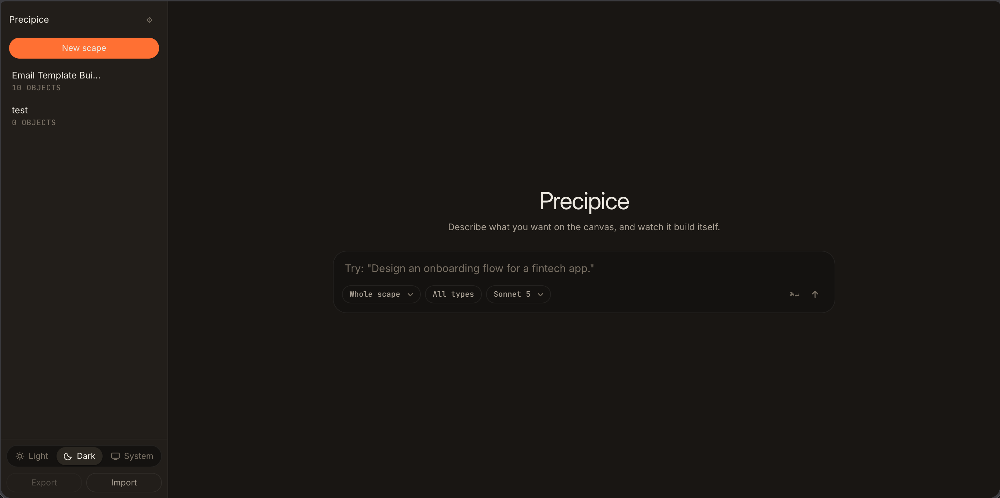
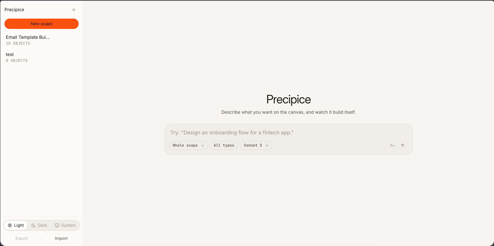
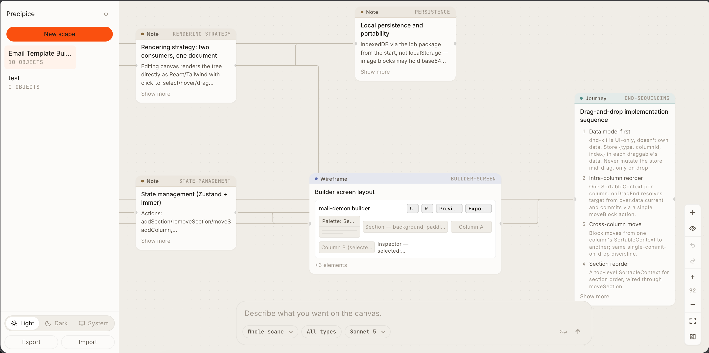
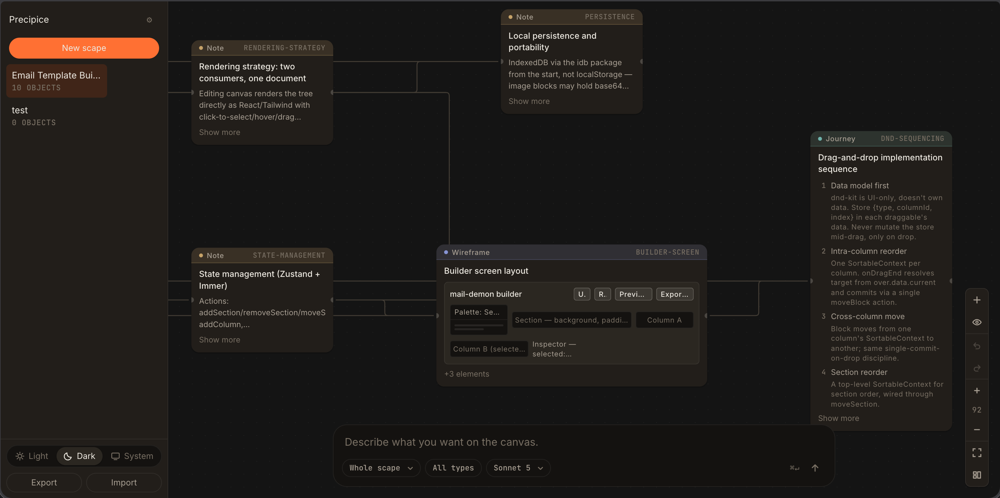
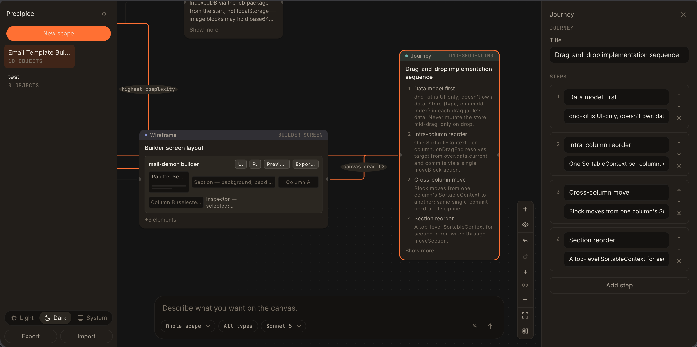
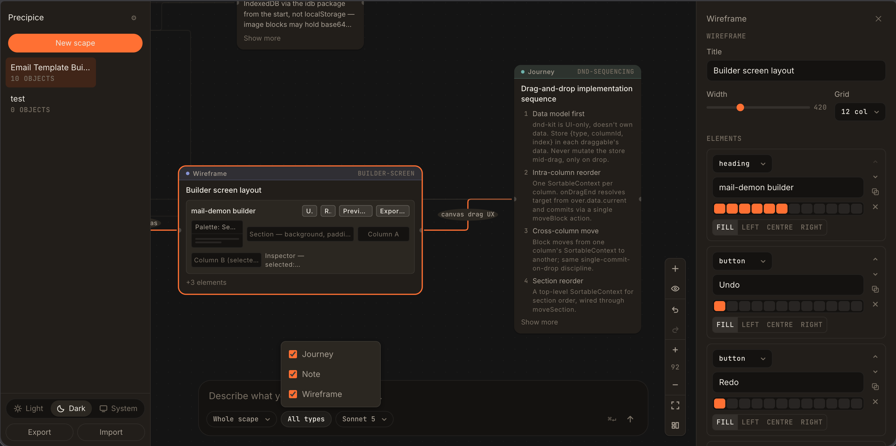

# Precipice

Copyright © 2026 [Madhav M Nair](https://www.linkedin.com/in/madhav-m-nair-b20767345/).

Precipice is a visual workspace for turning product ideas into connected,
editable artifacts. Start with a prompt or a blank scape, then shape the result
with notes, journeys, wireframes, and relationships on an infinite canvas.

> Precipice is an early-stage project. Expect active development, rough edges,
> and occasional changes while the core workspace loop is being refined.

## Try it online

Open the hosted app at **[precipice.pages.dev](https://precipice.pages.dev)**.

For a first look:

1. Open the link in a modern browser.
2. Choose **New scape** in the sidebar, or open the example scape if it is already present.
3. Use the canvas controls to pan, zoom, select objects, and show or hide relationship lines.
4. Select a Wireframe object to inspect its grid, elements, labels, widths, and alignment controls.
5. Switch between Light, Dark, and System themes from the lower-left theme control.

The hosted version stores scapes locally in your browser. It is not a shared
cloud workspace, so exporting a `.scape` file is the safest way to move work
between browsers or machines.

## What is included

- A React Flow canvas with selection, relationships, pan/zoom, layout, and undo.
- Note, Journey, and Wireframe object types with editable inspectors.
- Wireframe grids with sections, labelled elements, spans, alignment, sizing, and presets.
- Local persistence with autosave and `.scape` export/import.
- Theme controls, object-type filters, and relationship-line visibility controls.
- AI generation foundations with a Cloudflare Worker proxy and recorded fixtures for development.

## Screenshots

### Workspace

The main workspace begins with a prompt surface and a scape sidebar. Both themes
are supported.





### Canvas

The canvas connects notes, journeys, and wireframes into a navigable product map.






### Inspectors and controls

Inspect and edit journey steps or wireframe elements without leaving the canvas.
Filters and line controls keep larger scapes readable.







### Development surfaces

The repository also contains standalone harnesses for persistence, canvas,
objects, and AI work. They are useful for contributors and automated testing,
but are not required for trying the hosted app.


## Non-developer setup

You do not need Node.js or a terminal to try Precipice: use the hosted link above.

If you want a local copy but are not a developer, install the current LTS version
of [Node.js](https://nodejs.org/), then:

1. Download the repository from GitHub using **Code → Download ZIP**, and unzip it.
2. Open a terminal in the unzipped `precipice-idea-scapes` folder.
3. Run `corepack enable`, then `pnpm install`.
4. Run `pnpm dev`.
5. Open the local address printed by the command, usually `http://localhost:5173`.

To make a production build locally, run `pnpm build`. To preview that build,
run `pnpm preview`.

## Developer setup

```sh
corepack enable
pnpm install
pnpm dev
```

Useful checks:

```sh
pnpm test
pnpm build
```

The project uses TypeScript, React, Vite, Vitest, React Flow, Dagre, Dexie,
Zustand, and the Vercel AI SDK with Anthropic support.

## Security and privacy

- Scapes and settings are stored locally in the browser through IndexedDB; the hosted app does not provide a shared server-side scape database.
- Production AI requests are sent through the Cloudflare Worker at `https://precipice-ai-proxy.precipice.workers.dev`; the Anthropic server secret belongs in the Worker, never in committed source or frontend build output.
- The Worker accepts requests only from the hosted Precipice origin, limits request bodies to 256 KiB, and applies a per-IP request limit.
- The development AI harness may accept a locally supplied API key. Treat it as development-only and never paste production secrets into screenshots, issues, commits, or chat logs.
- Do not commit `.env` files, API keys, Cloudflare tokens, or generated credentials. Use GitHub Actions secrets for deployment credentials.
- Report suspected vulnerabilities privately through [GitHub’s security advisory form](https://github.com/Mad7droid/precipice-idea-scapes/security/advisories/new). See [SECURITY.md](SECURITY.md) for the reporting policy.

## Project status and contributing

Precipice is being developed in small, testable phases. The current focus is
the end-to-end workspace loop: create a scape, add or generate artifacts, edit
them in place, and preserve the result locally.

Please record user-visible changes in [CHANGELOG.md](CHANGELOG.md) whenever a
change is added to `main`. Bug reports and focused pull requests are welcome.

## License

Precipice is released under the [MIT License](LICENSE).
