# Precipice

Copyright © 2026 [Madhav M Nair](https://www.linkedin.com/in/madhav-m-nair-b20767345/).

Precipice is a visual workspace for turning product ideas into connected,
editable artifacts. Start with a prompt or a blank scape, then shape the result
with notes, journeys, wireframes, and relationships on an infinite canvas.

> Precipice is an early-stage project. Expect active development, rough edges,
> and occasional changes while the core workspace loop is being refined.

## Try it online

Open the hosted app at **[precipice.pages.dev](https://precipice.pages.dev)**.

For a first look:

1. Open the link in a modern browser.
2. Choose a starter such as **All-in-one**, **Journey map**, **Mind map**, or **Screens**, or open an existing scape from the home page.
3. Use the canvas controls to pan, zoom, select objects, and show or hide relationship lines.
4. Select a Wireframe object to inspect its grid, elements, labels, widths, and alignment controls.
5. Switch between Light, Dark, and System themes from the top-right theme control.

The hosted version stores scapes locally in your browser. It is not a shared
cloud workspace, so exporting a `.scape` file is the safest way to move work
between browsers or machines.

AI generation needs your own Anthropic API key, added under Settings. There is
no hosted key: the deployment is a static site plus a stateless proxy, and a
shared key behind a public endpoint is a shared key anyone can spend.

## What is included

- A React Flow canvas with selection, relationships, pan/zoom, layout, and undo.
- Note, Journey, and Wireframe object types with editable inspectors.
- Wireframe grids with sections, labelled elements, spans, alignment, sizing, and presets.
- Local persistence with autosave and `.scape` export/import.
- Theme controls, object-type filters, and relationship-line visibility controls.
- AI generation foundations with a stateless CORS proxy and recorded fixtures for development.

## Screenshots

### Home and generation

The home surface combines prompt-driven creation, starter scapes, imports, theme
selection, settings, and locally saved scapes.

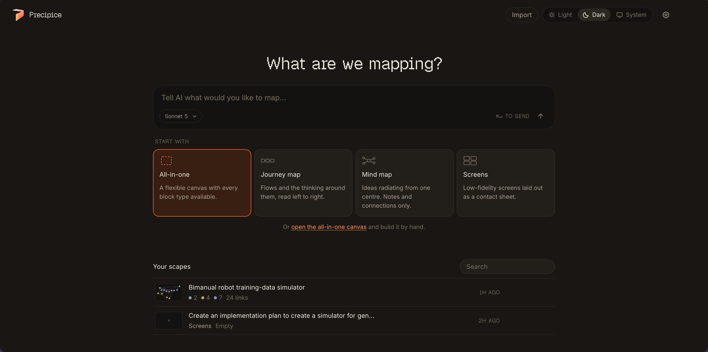

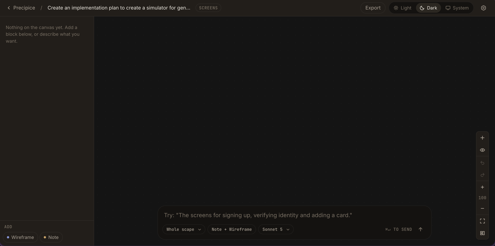

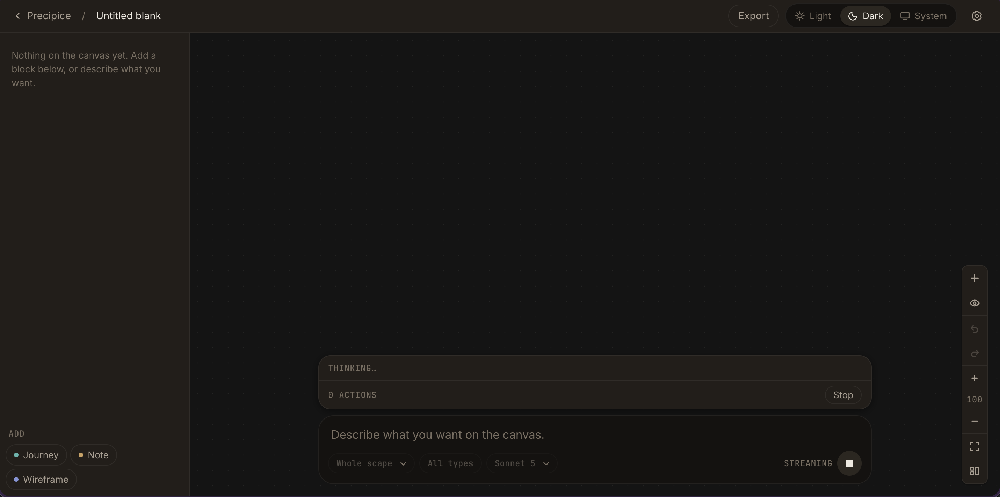

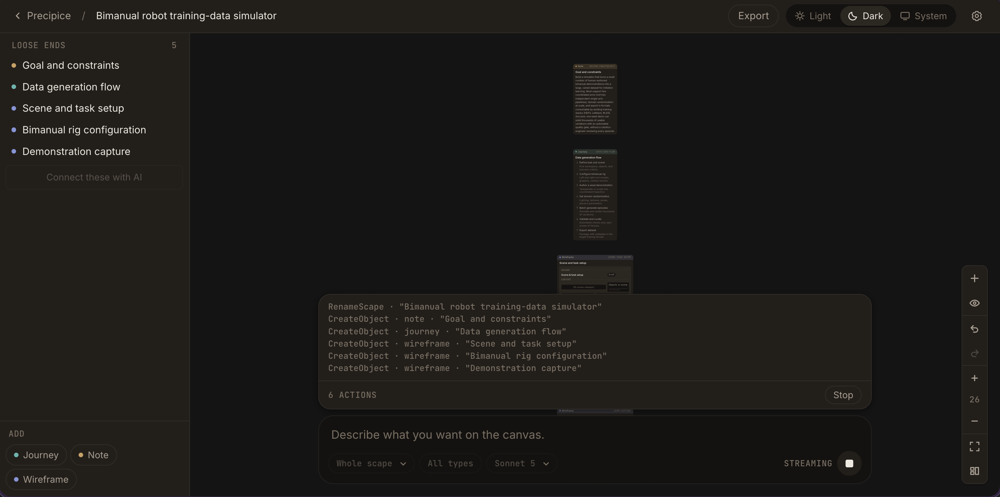

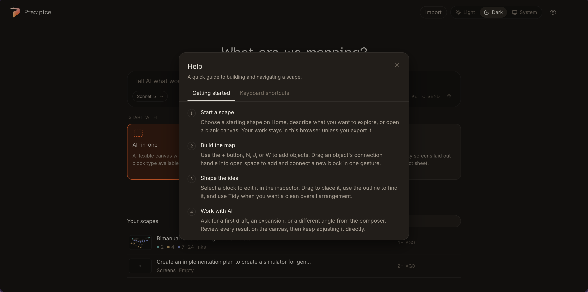

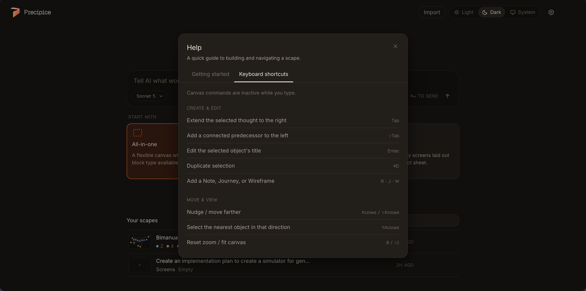

### Canvas

The canvas connects notes, journeys, and wireframes into a navigable product map.

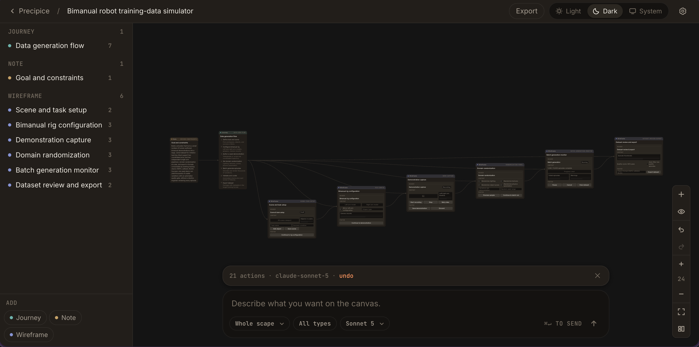

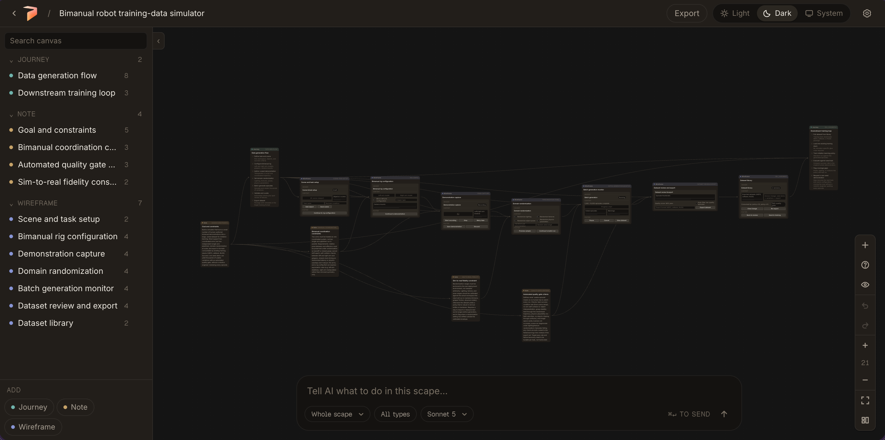

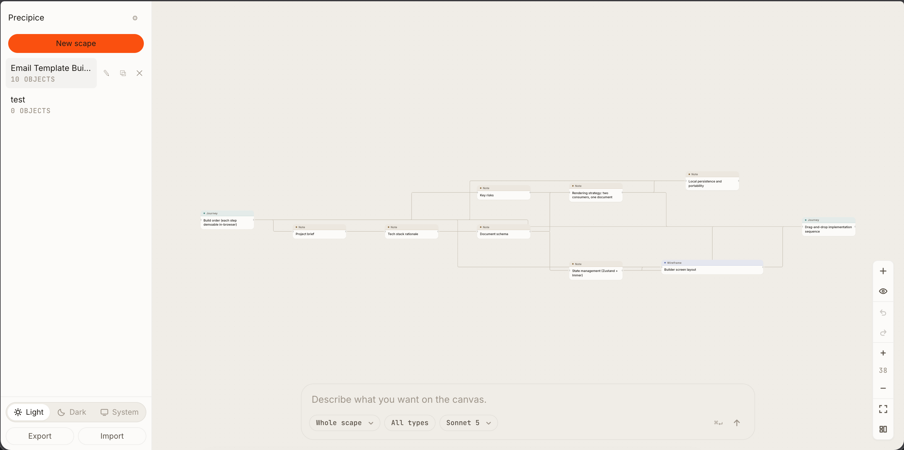

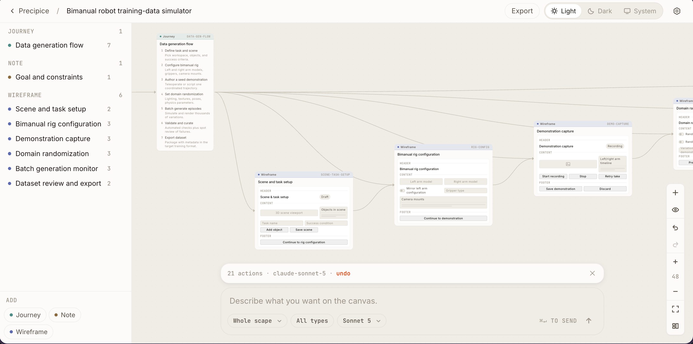

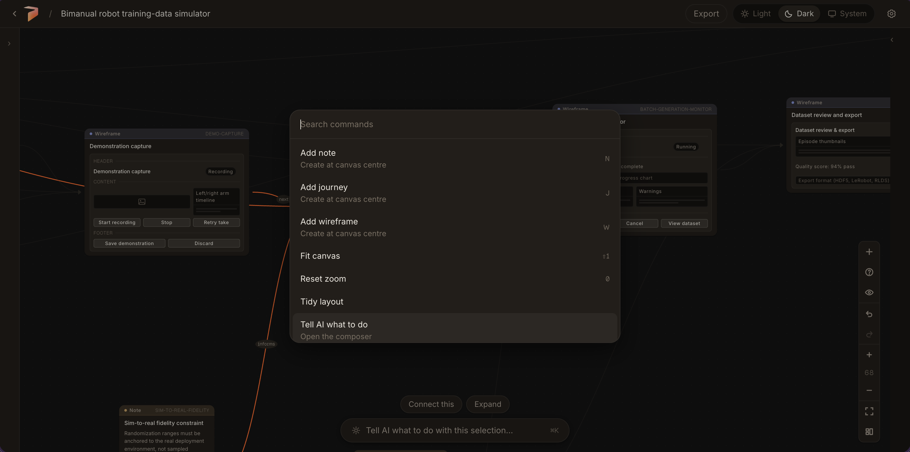

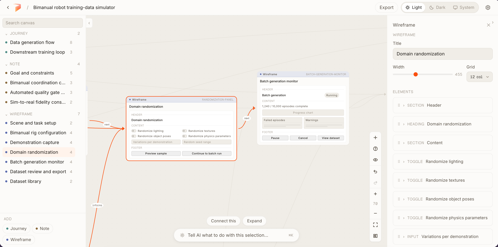

### Inspectors and controls

Inspect and edit journey steps or wireframe elements without leaving the canvas.
Filters and line controls keep larger scapes readable.

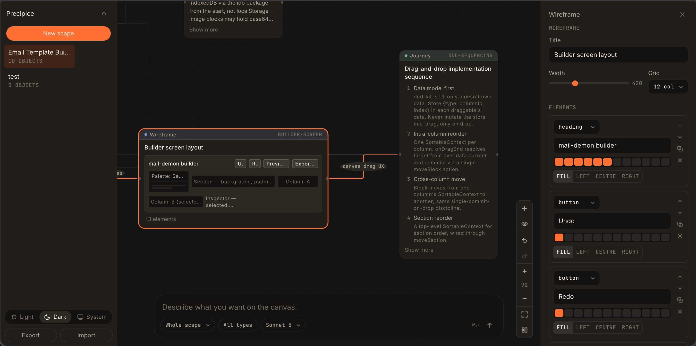

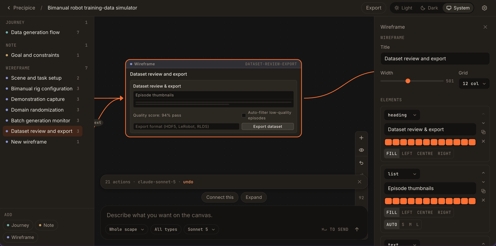

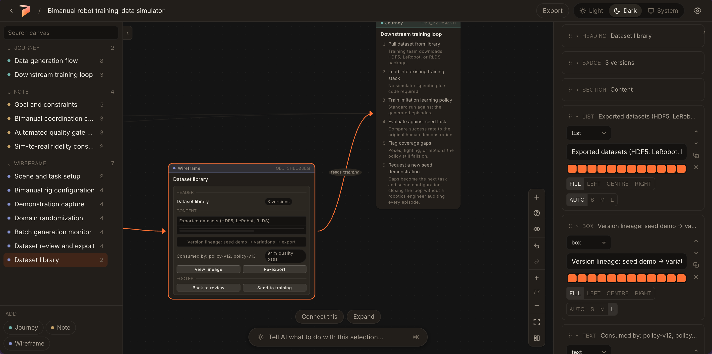

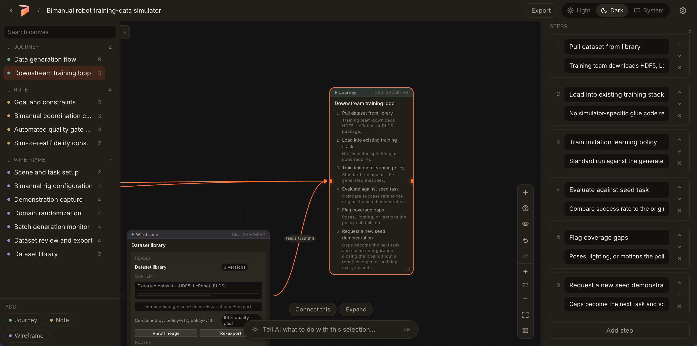

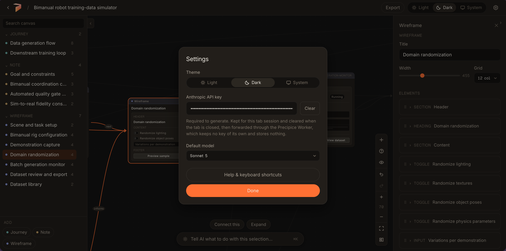

### Development surfaces

The repository also contains standalone harnesses for persistence, canvas,
objects, and AI work. They are useful for contributors and automated testing,
but are not required for trying the hosted app.

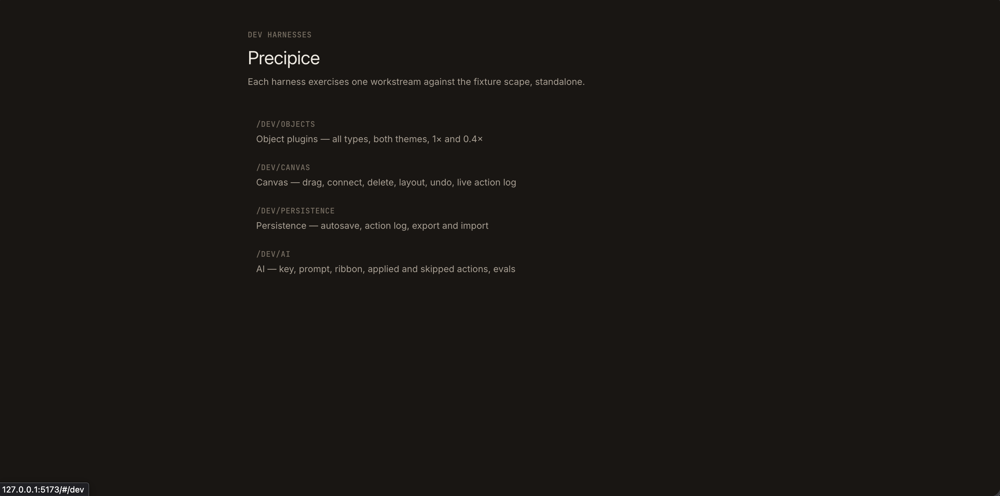

## Non-developer setup

You do not need Node.js or a terminal to try Precipice: use the hosted link above.

If you want a local copy but are not a developer, install the current LTS version
of [Node.js](https://nodejs.org/), then:

1. Download the repository from GitHub using **Code → Download ZIP**, and unzip it.
2. Open a terminal in the unzipped `precipice-idea-scapes` folder.
3. Run `corepack enable`, then `pnpm install`.
4. Run `pnpm dev`.
5. Open the local address printed by the command, usually `http://localhost:5173`.

To make a production build locally, run `pnpm build`. To preview that build,
run `pnpm preview`.

## Developer setup

```sh
corepack enable
pnpm install
pnpm dev
```

Useful checks:

```sh
pnpm test
pnpm build
```

The project uses TypeScript, React, Vite, Vitest, React Flow, Dagre, Dexie,
Zustand, and the Vercel AI SDK with Anthropic support.

## Security and privacy

For the full data-flow and Claude/Anthropic API-key model, see
[Security and local data](docs/security-and-local-data.md).

- Scapes and settings are stored locally in the browser through IndexedDB; the hosted app does not provide a shared server-side scape database.
- AI requests are sent through a stateless Cloudflare Worker proxy. Generation requires your own Anthropic key, added in Settings; it is kept only for the current tab session, survives reloads, clears when the tab is closed, and is forwarded for generation requests only.
- The Worker holds no Anthropic credential of its own and stores nothing. It exists to add CORS headers, and it rejects any request that does not carry a key.
- The Worker forwards an allowlist of headers upstream, limits request bodies to 256 KiB, and returns `Cache-Control: no-store`. Its per-IP counter is best-effort abuse damping only: Worker isolates do not share memory, so it is not a dependable rate limit. Configure the Cloudflare dashboard rate-limiting rule below for authoritative edge protection.
- Its origin check gates CORS, not authorization. `Origin` is forgeable by any non-browser client, so nothing sensitive is placed behind it.
- The development AI harness and the main workspace may accept a locally supplied API key. Treat it as sensitive browser-local data and never paste production secrets into screenshots, issues, commits, or chat logs.
- Do not commit `.env` files, API keys, Cloudflare tokens, or generated credentials. Use GitHub Actions secrets for deployment credentials.
- Report suspected vulnerabilities privately through [GitHub’s security advisory form](https://github.com/Mad7droid/precipice-idea-scapes/security/advisories/new). See [SECURITY.md](SECURITY.md) for the reporting policy.

### Cloudflare edge rate limit

In the Cloudflare dashboard for `precipice-ai-proxy`, add a rate-limiting rule for its Worker hostname: match `POST` requests whose path is exactly `/v1/messages`, use the client IP as the characteristic, and set a threshold of 60 requests per 60 seconds. Block matching clients for 60 seconds. This is deliberately generous enough for normal use and the five-request development eval while protecting Worker capacity from automated loops.

## Project status and contributing

Precipice is being developed in small, testable phases. The current focus is
the end-to-end workspace loop: create a scape, add or generate artifacts, edit
them in place, and preserve the result locally.

Please record user-visible changes in [CHANGELOG.md](CHANGELOG.md) whenever a
change is added to `main`. Bug reports and focused pull requests are welcome.

## License

Precipice is released under the [MIT License](LICENSE).
