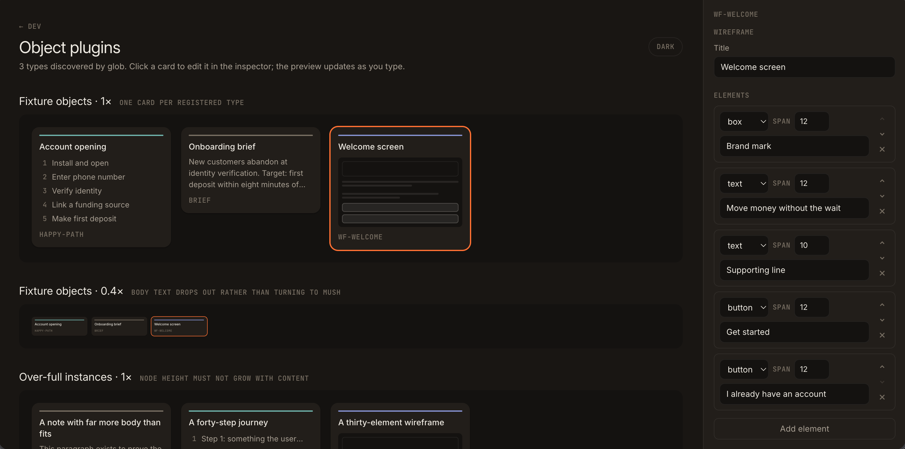
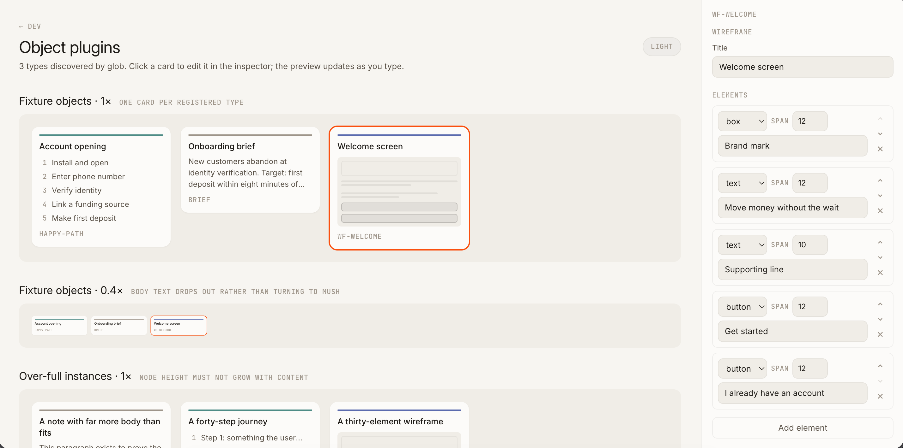
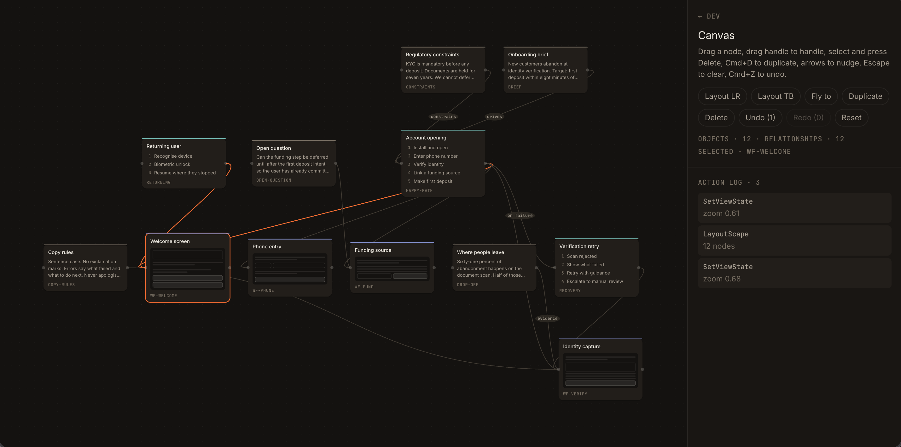
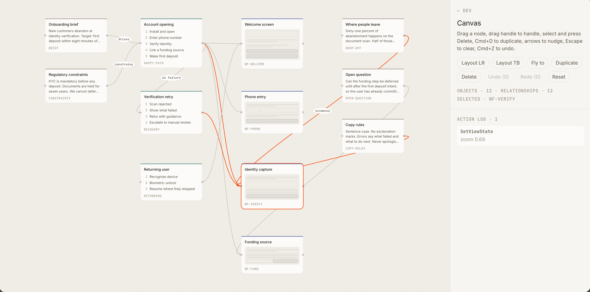
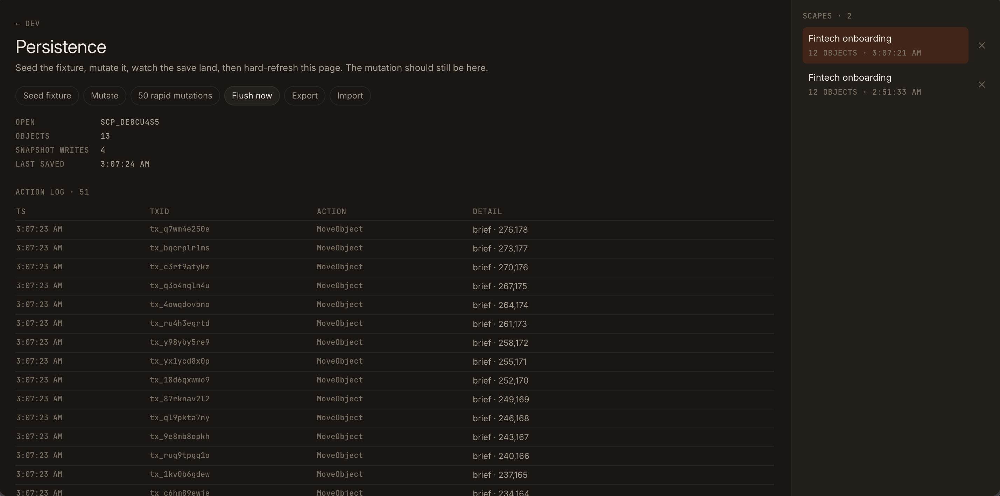

# Precipice

Precipice is a canvas-based workspace for turning product ideas into connected,
editable artifacts. The long-term goal is to make it easy to explore a product
concept as a living map of notes, journeys, wireframes, and AI-generated actions.

## Current state

This is an early walking skeleton rather than a finished product. The current
phase proves the main building blocks in standalone development harnesses:

- A React Flow canvas with objects, relationships, layout, selection, and undo.
- Note, Journey, and Wireframe object types with editable inspectors.
- Local persistence with autosave, action history, and `.scape` export/import.
- Early AI action and streaming foundations, including recorded fixtures for testing.

The main workspace and AI prompt flow are not connected yet. The screenshots below
show the current development surfaces and are intended to communicate progress,
not the final product experience.

## Screenshots

### Development harnesses

The route index collects the standalone surfaces used to exercise each workstream.

### Object plugins

These views show the three supported object types, their visual treatments, scale
behavior, and the live inspector. Both light and dark themes are represented.

### Canvas

The canvas views show a connected fixture scape with automatic layout, typed nodes,
relationships, selection, and an action log. The canvas is currently a functional
development surface, not yet the complete product workspace.

### Persistence

The persistence view demonstrates local scapes, autosave, mutation history, and the
export/import workflow.

## What to expect next

Over the next few weeks, the focus is expected to be on:

- Connecting the existing canvas, objects, persistence, and AI pieces into one usable workspace.
- Adding the first end-to-end flow: create a scape, enter a prompt, and watch artifacts appear.
- Completing settings and API-key handling, then tightening error states and build reliability.
- Refining the interaction model and visual polish based on hands-on testing.

The project is intentionally being developed in small, testable phases. More features
will follow after the core workspace loop feels dependable.
